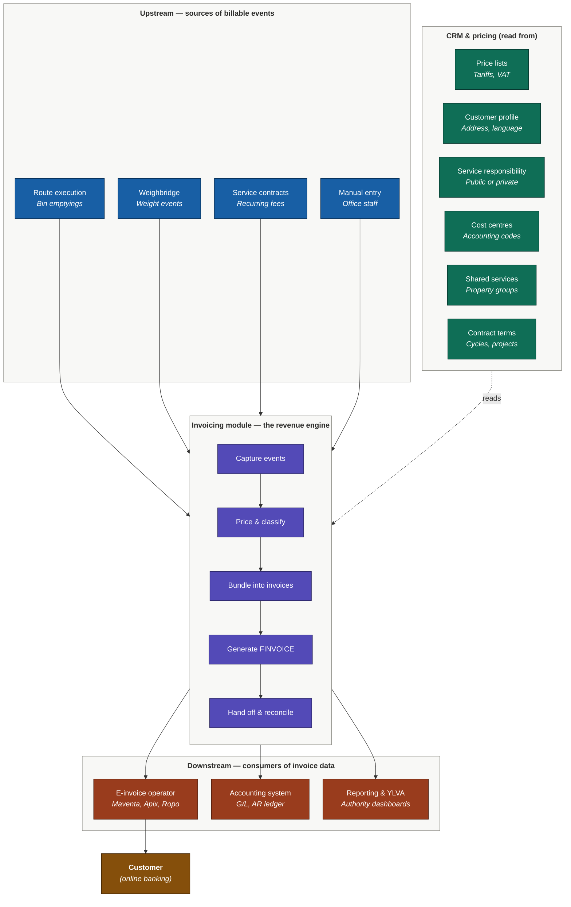

# PJH Invoicing Module — System Analysis

**Purpose:** Understand what the invoicing module is for PJH, how it touches the rest of the platform, and what the foundational base is — before designing a base-first release plan.

**Source:** All claims anchor to specific requirements in Jira release [11436](https://ioteelab.atlassian.net/projects/PD/versions/11436/tab/release-report-all-issues).

---

## Module dependency map

The invoicing module sits at the centre of five touchpoints: billable events flow in from operational systems, pricing and customer master data is read from the CRM, accounting classification is written to the financial backbone, and finished invoices are handed off to the external e-invoice operator.

**How to read this diagram:** The invoicing module (centre, purple) is the revenue engine, and it sits between four neighbours. From the left and top, **operational systems** (blue) push billable events into the module — every bin emptied, every truck weighed, every recurring fee. From the side, the **CRM and pricing catalogue** (teal) is read into the module — it tells the engine how to price the event, who the customer is, what classification applies. From the bottom, the module produces three outputs (coral): a FINVOICE XML stream sent to an **e-invoice operator** (which then delivers to the customer's online banking, in amber), G/L entries sent to the **accounting system**, and structured data sent to **reporting and authority dashboards**. The five-step pipeline inside the module (capture → price → bundle → generate → hand off) is the sequence each event runs through on its way to becoming an invoice.

---

## What the invoicing module *is* for PJH

### Claim: At its core, it turns operational work into money the company gets paid for.

Every day PJH performs work — emptying bins, weighing waste at a reception facility, providing recurring services under contract. Each piece of work is a billable event. The invoicing module's purpose is to take those events, attach the right price and the right accounting information to them, group them into invoices that the company can send out, and hand them off to an external system that delivers them to customers.

If everything worked perfectly, that's the whole story: work happens, gets billed, customer pays. The complexity of the module comes from making sure the *right* customer gets billed the *right* amount under the *right* legal framework — and that the data flows correctly into accounting, reporting, and the operator that delivers the final document.

### Claim: Its core job is turning operational events into legally compliant invoices.

The system must record events that can be used to generate customer invoices, with a defined schema ([PD-299](https://ioteelab.atlassian.net/browse/PD-299)). This means every time a bin is emptied, a truck is weighed, or a sludge tank is drained, the system creates a structured event with date, product, quantity, price, VAT, accounts, cost centre, etc. — and that event is what gets turned into an invoice line later. The event is the unit of work.

Each event must carry mandatory data before it can be transferred to invoicing ([PD-278](https://ioteelab.atlassian.net/browse/PD-278)). This means an event missing its cost centre or accounting account can't enter the invoice generation pipeline at all — the system has to catch this and flag it for an office worker to fix, rather than silently produce a broken invoice.

### Claim: It has five jobs (capture, price, classify, bundle, hand off).

| Job | What it means in practice | Anchoring PDs |
|-----|---------------------------|---------------|
| **Capture billable events** | Receive events from route execution, weighbridge, manual entry, recurring service contracts, and shared service splits — all in a uniform event format | [PD-299](https://ioteelab.atlassian.net/browse/PD-299), [PD-283](https://ioteelab.atlassian.net/browse/PD-283), [PD-280](https://ioteelab.atlassian.net/browse/PD-280), [PD-279](https://ioteelab.atlassian.net/browse/PD-279), [PD-288](https://ioteelab.atlassian.net/browse/PD-288) |
| **Price correctly** | Apply the right tariff, VAT, minimum fee, surcharges, gross/net rules, and reverse-charge logic to the event based on the event date and customer profile | [PD-319](https://ioteelab.atlassian.net/browse/PD-319), [PD-286](https://ioteelab.atlassian.net/browse/PD-286), [PD-294](https://ioteelab.atlassian.net/browse/PD-294), [PD-300](https://ioteelab.atlassian.net/browse/PD-300), [PD-301](https://ioteelab.atlassian.net/browse/PD-301) |
| **Classify legally** | Stamp each line with the right public/private law tag, cost centre, accounting account, service responsibility, and VAT classification | [PD-284](https://ioteelab.atlassian.net/browse/PD-284), [PD-285](https://ioteelab.atlassian.net/browse/PD-285), [PD-295](https://ioteelab.atlassian.net/browse/PD-295), [PD-296](https://ioteelab.atlassian.net/browse/PD-296), [PD-289](https://ioteelab.atlassian.net/browse/PD-289) |
| **Bundle into invoices** | Group events into invoices based on per-customer billing cycle, batch filters, restrictions, and assign legally compliant invoice numbers | [PD-291](https://ioteelab.atlassian.net/browse/PD-291), [PD-290](https://ioteelab.atlassian.net/browse/PD-290), [PD-293](https://ioteelab.atlassian.net/browse/PD-293), [PD-292](https://ioteelab.atlassian.net/browse/PD-292), [PD-309](https://ioteelab.atlassian.net/browse/PD-309) |
| **Hand off and reconcile** | Generate FINVOICE 3.0 output, send to operator, handle credit notes, cancellations, and transfers of billed events | [PD-310](https://ioteelab.atlassian.net/browse/PD-310), [PD-107](https://ioteelab.atlassian.net/browse/PD-107), [PD-269](https://ioteelab.atlassian.net/browse/PD-269), [PD-273](https://ioteelab.atlassian.net/browse/PD-273), [PD-275](https://ioteelab.atlassian.net/browse/PD-275) |

### Claim: It is a *regulated* revenue engine, not a generic billing module.

The five jobs above could describe Stripe, Chargebee, or any generic SaaS billing system. What makes this module different is that PJH operates under Finnish waste regulation, and the module has to enforce specific legal rules that a generic billing system has no concept of.

**Public-law vs private-law transactions.** The module must handle both public-law and private-law transactions under different collection processes ([PD-285](https://ioteelab.atlassian.net/browse/PD-285), [PD-284](https://ioteelab.atlassian.net/browse/PD-284)). This means that, for example, if a municipal customer doesn't pay an invoice for household waste collection (public law), the unpaid amount can be sent to ulosotto (Finnish direct enforcement) without a court judgment — but if a business customer doesn't pay for a commercial waste container rental (private law), it follows normal commercial debt collection. The same WasteHero invoice can contain both kinds of lines, and each line has to be tagged correctly so the right collection process kicks in downstream.

**Service responsibility classification tied to the Waste Act §33** ([PD-363](https://ioteelab.atlassian.net/browse/PD-363)). This means the system has to track when a business customer classified under municipal service responsibility (kunnan toissijainen velvollisuus) has been invoiced more than €2,000 in a year, and automatically raise a flag — because Finnish law requires the waste company to review whether that customer should still be in municipal responsibility or move to a market-based contract.

**Retroactive service responsibility changes** ([PD-364](https://ioteelab.atlassian.net/browse/PD-364)). This means that if a regulator decides commercial waste from a specific property type moves out of municipal responsibility effective 1 January, the office worker can apply that change in March and have all uninvoiced events from 1 January re-classified — without touching invoices that already went out.

A generic SaaS billing module like Stripe or Chargebee doesn't have any of these concepts. They're specific to how Finnish waste regulation works.

### Claim: The module does not own the customer-facing PDF or the accounts receivable ledger.

WasteHero does not maintain accounts receivable data — it lives in the external invoicing system ([PD-306](https://ioteelab.atlassian.net/browse/PD-306)). This means once an invoice is sent to Ropo (or whichever operator PJH uses), the question "has this customer paid?" is answered by Ropo, not WasteHero. WasteHero only sees the invoice image when it asks Ropo for it via an API.

WasteHero does not create or manage invoice templates ([PD-307](https://ioteelab.atlassian.net/browse/PD-307)). This means the visual layout, logo placement, footer text, and styling of the final PDF the customer opens in their bank are all handled by the operator. WasteHero just sends a "use template X" code in the FINVOICE data, and the operator does the rendering.

This boundary matters because it changes what's in scope. We don't need to build a PDF designer, an AR ageing tool, or a payment reconciliation engine — those are outside the module.

---

## What is FINVOICE?

FINVOICE comes up repeatedly throughout the requirements ([PD-310](https://ioteelab.atlassian.net/browse/PD-310), [PD-305](https://ioteelab.atlassian.net/browse/PD-305), [PD-304](https://ioteelab.atlassian.net/browse/PD-304), [PD-308](https://ioteelab.atlassian.net/browse/PD-308), [PD-307](https://ioteelab.atlassian.net/browse/PD-307), [PD-289](https://ioteelab.atlassian.net/browse/PD-289), [PD-285](https://ioteelab.atlassian.net/browse/PD-285), [PD-302](https://ioteelab.atlassian.net/browse/PD-302), [PD-301](https://ioteelab.atlassian.net/browse/PD-301), [PD-300](https://ioteelab.atlassian.net/browse/PD-300), [PD-107](https://ioteelab.atlassian.net/browse/PD-107)). It's the most-referenced external standard in the whole release. Before designing the foundation, the team needs a shared understanding of what it is.

### What it is, in one sentence

FINVOICE is the Finnish national e-invoice standard — an XML message format and a delivery network — maintained by [Finanssiala ry](https://www.finanssiala.fi/en/topics/finvoice-standard/) (Finance Finland, the industry body for Finnish banks). The current version is 3.0, aligned with the EU e-invoicing directive 2014/55 (EN16931). It's used for an estimated 85% of B2B invoices in Finland (~300 million invoices/year) and is mandatory for invoicing Finnish state agencies.

### What it actually is, technically

A FINVOICE invoice is an XML file. It is **not** a PDF, **not** a screenshot, **not** an email. It is structured data with a fixed schema. This means when WasteHero produces a FINVOICE invoice, what's transmitted is a machine-readable XML document containing every invoice line, every VAT amount, every reference number, every accounting code — in named XML elements that downstream systems (banks, accounting software, e-procurement portals) can parse automatically.

The recipient's bank (or accounting software) parses this XML and renders it into whatever visual form the recipient sees — a PDF in their online banking, a row in their accounting ledger, an entry in their procurement system. The sender doesn't control the visual rendering. That's why [PD-307](https://ioteelab.atlassian.net/browse/PD-307) explicitly says WasteHero doesn't create or manage invoice templates — those live downstream.

### Message types FINVOICE supports

FINVOICE distinguishes invoice purposes through message type codes in the XML. The ones relevant for PJH:

| Code | Purpose | Relevant PD |
|------|---------|-------------|
| **INV01** | Regular invoice | [PD-310](https://ioteelab.atlassian.net/browse/PD-310) |
| **INV02** | Credit note (hyvityslasku) | [PD-269](https://ioteelab.atlassian.net/browse/PD-269) |
| **INV05** | Payment reminder (muistutuslasku) | Out of MVP scope; PJH uses Ropo for reminders |
| **INV08** | Interest invoice (korkolasku) | Out of MVP scope |
| **SEI01 / SEI02** | Public sector / classified invoice | [PD-284](https://ioteelab.atlassian.net/browse/PD-284), [PD-285](https://ioteelab.atlassian.net/browse/PD-285) — relevant because PJH issues public-law invoices |

This means credit notes are not a "negative invoice" — they are a separate FINVOICE message type (INV02) with their own structure, their own number, and a reference to the original invoice. This is the technical reason credit notes must be a first-class subtype in the data model ([PD-269](https://ioteelab.atlassian.net/browse/PD-269)), not a status flag.

### What FINVOICE *requires* on every invoice

The schema dictates which fields are mandatory. Key ones the data model must carry:

- **Sender** — name, business ID (Y-tunnus), VAT ID, address, bank/operator details
- **Recipient** — party name **plus at least one of**: electronic address (OVT/IBAN-based identifier), organisation number, postal address, or email address
- **Invoice number** — unique, formatted per Finnish accounting law ([PD-309](https://ioteelab.atlassian.net/browse/PD-309))
- **Invoice date, due date, payment terms**
- **Payment reference (viitenumero)** — the Finnish-specific structured reference the payer enters into online banking
- **Per-row data** — article name, quantity, unit price, VAT rate, VAT code (`S` = standard, `Z` = zero-rated, `AE` = reverse charge, etc.), row total, optional discount/charge details
- **Per-row VAT breakdown** — invoiced quantity, unit price net amount, row VAT amount, row VAT-excluded amount
- **Summary totals** — net, VAT, gross
- **Language code** — FI, SV, or EN ([PD-308](https://ioteelab.atlassian.net/browse/PD-308))

The PJH-specific requirements layer additional fields on top: cost centre, service responsibility, waste type, public/private law classification, eco-fee breakdown ([PD-310](https://ioteelab.atlassian.net/browse/PD-310), [PD-296](https://ioteelab.atlassian.net/browse/PD-296), [PD-299](https://ioteelab.atlassian.net/browse/PD-299), [PD-289](https://ioteelab.atlassian.net/browse/PD-289)).

This is why "design the data model first, then design the UI" matters so much — if the invoice line model is missing a VAT code field at the start, every downstream feature (rendering, editing, batch generation) inherits the gap and has to be retrofitted.

### How FINVOICE delivers an invoice

FINVOICE is both a *format* and a *network*. The diagram below shows the four-hop journey an invoice takes from WasteHero to the recipient — each arrow is a separate system handoff, and the format of the message at each step is shown on the arrow label.

```mermaid
%%{init: {'flowchart': {'padding': 15, 'nodeSpacing': 30, 'rankSpacing': 40, 'subGraphTitleMargin': {'top': 10, 'bottom': 15}}}}%%
flowchart LR
    WH["WasteHero<br/><i>generates XML</i>"]
    Op["Sender's operator<br/><i>Ropo, Maventa, Apix</i>"]
    Bank["Recipient's bank<br/><i>or operator</i>"]
    Recipient["Recipient<br/><i>company or consumer</i>"]

    WH -->|"FINVOICE 3.0 XML"| Op
    Op -->|"Validates & routes"| Bank
    Bank -->|"Renders to PDF<br/>or imports to ERP"| Recipient

    classDef wh fill:#534AB7,stroke:#26215C,color:#FFFFFF
    classDef op fill:#993C1D,stroke:#4A1B0C,color:#FFFFFF
    classDef recipient fill:#854F0B,stroke:#412402,color:#FFFFFF

    class WH wh
    class Op,Bank op
    class Recipient recipient
```

This means: WasteHero hands the XML to a Finnish operator (PJH currently uses Ropo per existing context). The operator validates the XML against the FINVOICE schema (XSD validation, plus EN16931 business rules if the EU specification identifier is set). The operator then routes the invoice to the recipient's bank or e-invoice operator using a SOAP-based transmission frame. The recipient's system parses the XML and either renders it for a consumer (in online banking) or ingests it into accounting software (for a business). PJH never talks directly to the recipient — the operator handles the network handoff.

### What this means commercially

Generating valid FINVOICE XML is an engineering problem. Transmitting it is a commercial problem ([PD-107](https://ioteelab.atlassian.net/browse/PD-107)). To send invoices on the Finnish e-invoice network, the sender must have a signed agreement with an accredited operator (Ropo, Maventa, Apix, Basware, or one of the banks). This is a multi-week-to-multi-month process involving onboarding, contract, technical setup, test transmissions, and certification. PJH already has a Ropo agreement, so this is partially de-risked — but every new flow (credit notes, reminders, attachments) typically requires sign-off from the operator before going live.

### What about attachments?

PDFs can be attached to FINVOICE messages, but with strict limits per the FINVOICE 3.0 implementation guidelines, captured in [PD-305](https://ioteelab.atlassian.net/browse/PD-305) and [PD-304](https://ioteelab.atlassian.net/browse/PD-304):

- Maximum 10 attachments per message
- Total size under 1 MB before Base64 encoding
- Only PDF/A, JPEG, and PNG formats accepted
- Each attachment carries an identifier (composed of the message ID + a SHA1 hash of the attachment content)
- Confidential attachments use the `AttachmentSecurityClass` field with a SEI code

This means we can't, for example, attach a 5 MB waste delivery report to every invoice. The constraint shapes what features make sense — bulk attachments to a whole invoice batch ([PD-304](https://ioteelab.atlassian.net/browse/PD-304)) often need to be hosted on the operator's side and referenced by ID rather than embedded in the XML.

### Why this matters for the base-first plan

Three takeaways from the FINVOICE deep-dive that shape the foundation:

1. **FINVOICE is the output contract.** Every field FINVOICE requires must exist in the invoice data model. Designing the model without checking against FINVOICE means rework.

2. **Credit notes are a different FINVOICE message type (INV02), not a status flag.** This is why [PD-269](https://ioteelab.atlassian.net/browse/PD-269) requires credit notes as a first-class subtype.

3. **The recipient's address fields are mandatory at the FINVOICE level.** This means [PD-282](https://ioteelab.atlassian.net/browse/PD-282) (e-invoice address management) is not just a CRM nicety — it's a hard prerequisite for invoice transmission. An invoice missing the recipient's electronic address won't route.

---

## How it touches the rest of the platform

### 1. Operational systems (upstream — events flow in)

Route execution feeds bin emptying events (implied throughout [PD-299](https://ioteelab.atlassian.net/browse/PD-299), [PD-296](https://ioteelab.atlassian.net/browse/PD-296)). This means when a driver presses "emptied" on their tablet, an event is created in the system with the timestamp, the container ID, the address, the driver, and the vehicle — and that's what gets priced later.

Weighbridge feeds weight events ([PD-296](https://ioteelab.atlassian.net/browse/PD-296), [PD-299](https://ioteelab.atlassian.net/browse/PD-299)). This means when a truck drives across the scale at a reception facility, the weight, waste type (EWC code), and origin are captured automatically and turned into a billable event without manual entry.

Manual entry creates events for one-off charges ([PD-283](https://ioteelab.atlassian.net/browse/PD-283)). This means an office worker can invoice for things like land rent or consulting hours that don't come from any operational integration — they manually create an event tied to a predefined product so the accounting still flows correctly.

Service contracts generate recurring events ([PD-288](https://ioteelab.atlassian.net/browse/PD-288)). This means an annual base fee for a permanent residence (e.g. €150 invoiced every January) is a billable event the system creates automatically on a schedule, not something an office worker has to remember to create.

Shared service splits divide events across customers ([PD-280](https://ioteelab.atlassian.net/browse/PD-280), [PD-279](https://ioteelab.atlassian.net/browse/PD-279)). This means when four neighbours share a bio-waste container, one emptying event has to be split into four invoice lines — and the split percentages can change retroactively when a fifth neighbour joins mid-year.

### 2. CRM / customer master data (read from)

Customer language preference ([PD-308](https://ioteelab.atlassian.net/browse/PD-308)). This means an invoice for a Swedish-speaking customer is generated with Swedish product names and headings, while the same product for a Finnish-speaking customer reads in Finnish — driven by a field on the customer profile.

E-invoice address ([PD-282](https://ioteelab.atlassian.net/browse/PD-282)). This means if a business customer wants e-invoices delivered to their accounting system (e.g. an OVT identifier), that address sits on the customer profile and gets pulled into the FINVOICE output.

Billing channel and address ([PD-281](https://ioteelab.atlassian.net/browse/PD-281)). This means if a property manager changes mid-year and reminders need to go to the new manager, the new address is updated in WasteHero and propagated to the invoicing system — including for invoices already issued.

Service responsibility classification ([PD-363](https://ioteelab.atlassian.net/browse/PD-363), [PD-364](https://ioteelab.atlassian.net/browse/PD-364)). This means each customer-property pair carries a classification (municipal primary, municipal secondary, market-based) and that classification drives both pricing and accounting.

### 3. Pricing & product catalogue (read from)

Price lists with VAT, account, and cost centre attached per product ([PD-296](https://ioteelab.atlassian.net/browse/PD-296)). This means a "Mixed waste 240L emptying" product isn't just a price — it's a price + VAT rate + accounting account + cost centre, all configured at the product level so events priced from it inherit the full financial classification.

Same product routed to different accounts based on context ([PD-295](https://ioteelab.atlassian.net/browse/PD-295)). This means the same "Mixed waste 240L emptying" can post revenue to account 30001 if the customer is in Helsinki under municipal responsibility, or to account 30002 if the customer is in Espoo under market-based contract — driven by rules, not by creating duplicate products.

### 4. Accounting / financial backbone (writes to)

Cost centres and accounts at line level ([PD-296](https://ioteelab.atlassian.net/browse/PD-296), [PD-295](https://ioteelab.atlassian.net/browse/PD-295)). This means every invoice line in the FINVOICE output carries the cost centre and accounting account, so when the company's external accounting system imports the data, it knows exactly which G/L bucket each euro lands in.

Public-law vs private-law accounting split ([PD-289](https://ioteelab.atlassian.net/browse/PD-289)). This means the same invoice can contain a public-law line (waste collection fee €50) and a private-law line (composter sale €120), and each line is tagged so the company's financial reporting can distinguish them — and so dunning can route correctly.

### 5. External delivery (writes to)

FINVOICE 3.0 to the e-invoice operator ([PD-310](https://ioteelab.atlassian.net/browse/PD-310)). This means the invoice is produced as a structured XML file conforming to the Finnish e-invoice standard, with all required fields and metadata, and handed to an operator (Ropo, Maventa, Apix) that distributes it to the customer's bank or accounting system.

E-invoice and direct debit information from the operator ([PD-107](https://ioteelab.atlassian.net/browse/PD-107)). This means when a customer goes to their bank and signs up for e-invoicing from PJH, the bank tells the operator, the operator tells WasteHero, and WasteHero updates the customer's billing channel automatically — without office staff intervention.

Authority access to issued invoices ([PD-171](https://ioteelab.atlassian.net/browse/PD-171)). This means when a citizen disputes a waste fee at the regional waste authority (jätehuoltoviranomainen), that authority can log into WasteHero and view the exact invoice that was sent — for due process.

---

## The three critical non-obvious dependencies

### 1. Time-of-event pricing context

Events must be priceable as of their event date, not as of invoice generation date ([PD-319](https://ioteelab.atlassian.net/browse/PD-319), [PD-364](https://ioteelab.atlassian.net/browse/PD-364), [PD-299](https://ioteelab.atlassian.net/browse/PD-299) — which requires VAT 0% and VAT 24% to be stored on the event itself). This means if a bin was emptied on 28 December 2025 at the old VAT rate, and the invoice is generated on 15 January 2026 after a VAT change, the system has to apply the old VAT rate — not today's. Same for retroactive price corrections and retroactive service responsibility changes.

### 2. Identity continuity

Properties outlive customers, and uninvoiced and billed events must move between customers when ownership changes ([PD-344](https://ioteelab.atlassian.net/browse/PD-344), [PD-276](https://ioteelab.atlassian.net/browse/PD-276), [PD-275](https://ioteelab.atlassian.net/browse/PD-275)). This means when a tenant moves out on 1 March, but the old tenant is still on the customer record until the office is told on 1 May, the system has to be able to transfer all the bin emptyings between 1 March and 30 April from the old tenant to the new tenant — and if some of those have already been invoiced, credit them from the old tenant and re-invoice the new one.

### 3. Reversibility under Finnish law

Corrections follow legal patterns (cancellation vs credit note), not technical patterns ([PD-273](https://ioteelab.atlassian.net/browse/PD-273), [PD-269](https://ioteelab.atlassian.net/browse/PD-269), [PD-275](https://ioteelab.atlassian.net/browse/PD-275)). This means "before send" corrections use cancellation (invoice number is released back into the pool, the invoice never legally existed), and "after send" corrections use credit notes (a separate legal document referencing the original invoice number, with its own number, satisfying Finnish accounting law). You can't reuse the same model for both, and you can't just flip a status flag.

---

## What the "base" actually is

| Foundation | Anchoring PDs | Why it's foundational (in plain terms) |
|------------|---------------|----------------------------------------|
| 1. **Event model with full schema** | [PD-299](https://ioteelab.atlassian.net/browse/PD-299), [PD-278](https://ioteelab.atlassian.net/browse/PD-278), [PD-296](https://ioteelab.atlassian.net/browse/PD-296) | Every billable thing in the system is an event. If the event schema is missing fields, every feature on top of it inherits that gap. PD-299 lists the exact fields required. |
| 2. **Classification model at line level** | [PD-284](https://ioteelab.atlassian.net/browse/PD-284), [PD-285](https://ioteelab.atlassian.net/browse/PD-285), [PD-289](https://ioteelab.atlassian.net/browse/PD-289), [PD-295](https://ioteelab.atlassian.net/browse/PD-295), [PD-296](https://ioteelab.atlassian.net/browse/PD-296), [PD-363](https://ioteelab.atlassian.net/browse/PD-363), [PD-364](https://ioteelab.atlassian.net/browse/PD-364) | Public/private law, cost centre, account, service responsibility — these stamp every line and drive accounting, collection, and reporting. Bolting them on after the fact means re-tagging historical data, which is painful and error-prone. |
| 3. **Invoice with credit note as a first-class subtype** | [PD-269](https://ioteelab.atlassian.net/browse/PD-269), [PD-275](https://ioteelab.atlassian.net/browse/PD-275), [PD-273](https://ioteelab.atlassian.net/browse/PD-273) | Credit notes are legal documents in Finland, not status flags. If credit notes are modelled wrong from day one, every correction-related feature (transfers, retroactive changes, AR data) inherits the broken model. |
| 4. **Configurable billing cycle engine** | [PD-290](https://ioteelab.atlassian.net/browse/PD-290), [PD-291](https://ioteelab.atlassian.net/browse/PD-291) | PJH customers need monthly, quarterly, and annual cycles at the customer/property/service level. The current engine is hardcoded to Danish semi-annual. Every feature that reads "what billing period is this in" depends on this engine being right. |
| 5. **FINVOICE 3.0 schema mapping** | [PD-310](https://ioteelab.atlassian.net/browse/PD-310), [PD-307](https://ioteelab.atlassian.net/browse/PD-307), [PD-308](https://ioteelab.atlassian.net/browse/PD-308) | FINVOICE is the output contract. Designing the invoice data model without knowing what FINVOICE requires guarantees rework — you'll find missing fields when you go to generate the XML and have to add them everywhere. |
| 6. **Pricing rules engine** | [PD-279](https://ioteelab.atlassian.net/browse/PD-279), [PD-280](https://ioteelab.atlassian.net/browse/PD-280), [PD-286](https://ioteelab.atlassian.net/browse/PD-286), [PD-294](https://ioteelab.atlassian.net/browse/PD-294), [PD-300](https://ioteelab.atlassian.net/browse/PD-300), [PD-301](https://ioteelab.atlassian.net/browse/PD-301) | Shared service splits, minimum fees, reverse VAT, surcharges — these are pricing rules that transform raw events into invoiceable amounts. They have to be in the engine, not bolted onto the UI, because PD-279 requires dynamic recalculation when shared service membership changes. |

Everything else (UI to view invoices [PD-298](https://ioteelab.atlassian.net/browse/PD-298) / [PD-163](https://ioteelab.atlassian.net/browse/PD-163) / [PD-303](https://ioteelab.atlassian.net/browse/PD-303) / [PD-306](https://ioteelab.atlassian.net/browse/PD-306), edit events [PD-277](https://ioteelab.atlassian.net/browse/PD-277) / [PD-318](https://ioteelab.atlassian.net/browse/PD-318), filter batches [PD-293](https://ioteelab.atlassian.net/browse/PD-293), AR reports [PD-289](https://ioteelab.atlassian.net/browse/PD-289), simulation [PD-272](https://ioteelab.atlassian.net/browse/PD-272) / [PD-274](https://ioteelab.atlassian.net/browse/PD-274), error listings [PD-278](https://ioteelab.atlassian.net/browse/PD-278)) is built on top of these six. Get the six right and the UI is straightforward. Get the six wrong and the UI gets rebuilt twice.

---

*Document produced: 2026-05-18*
*Source: Jira release [11436](https://ioteelab.atlassian.net/projects/PD/versions/11436/tab/release-report-all-issues) (PJH Invoicing module, 52 requirements)*
