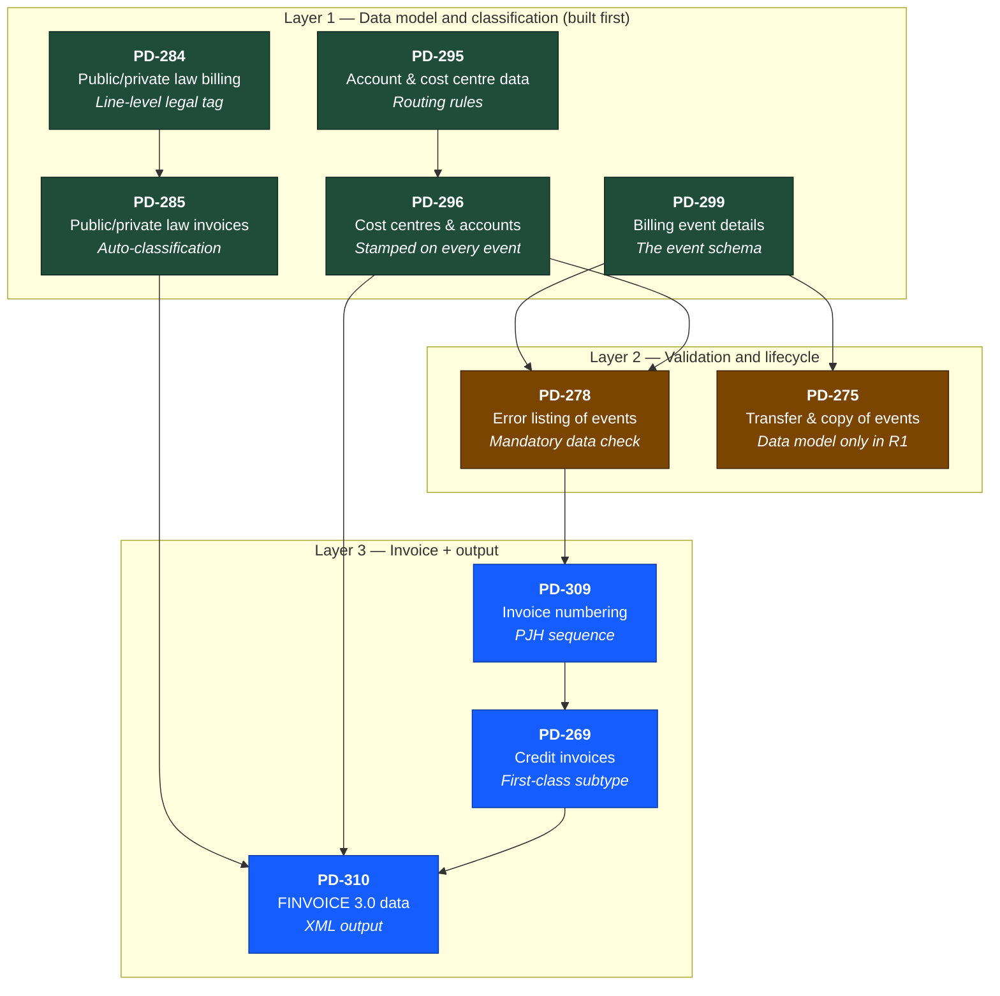

# PJH Invoicing — Release 1 Requirements

This doc lists the **10 PD requirements** the Ledger squad delivers in Release 1, with the exact `Requirement` text from each Jira ticket, a plain-language explanation of what the task is, and how the 10 tasks fit together as a system.

**Source:** All claims anchor to specific tickets in Jira release [11436](https://ioteelab.atlassian.net/projects/PD/versions/11436/tab/release-report-all-issues). The "From Jira" blockquotes below are the *exact text* from each ticket's "Requirement" section. Everything outside those blockquotes is explanation, not requirement text.

**Companion docs:**
- [pjh-invoicing-r1.md](./pjh-invoicing-r1.md) — the R1 release brief (why this is R1, foundation pieces, demo flow)
- [r1-mockup.html](./r1-mockup.html) — the interactive mockup of the screens

---

## How the 10 tasks fit together

Three layers, built bottom-up:

**How to read this:** an arrow from A to B means *B reads from A* or *B depends on A being in place*. Layer 1 holds the data model and classification — every other PD reads from it. Layer 2 sits on top, gating events into the invoicing pipeline and supporting transfers. Layer 3 produces the customer-facing output (invoice, credit note, FINVOICE XML).

---

## Layer 1 — Data model and classification

### [PD-299](https://ioteelab.atlassian.net/browse/PD-299) — Billing event details

**Jira title:** *3.4.13 Billing event details*

**What it is:** The schema for a single billing event. Every billable thing in the system — a bin emptying, a weighbridge reading, an annual base fee, a manual charge — gets stored as a row in the event table with all the fields needed to invoice it correctly under Finnish law.

> **From Jira (Requirement):**
> *"An event must be created in the system, from which invoicing material can be created. The event must be able to add at least the following information (not all events have this information): Date · Product/service · Product name / Service name · Waste price · Transportation price · Quantity (pcs, m³) · Weight (t/kg) · VAT price 0% · VAT price 24% · VAT 0% price total · VAT 24% price total · Registration number · Accounts · Cost locations · Free comment field · Customer number · Contractor · Registration number · Place of unloading · Event ID · Service responsibility · Origin · Direction · Municipality · Price according to the carpooling percentage of the contact collection point · Event comments."*

**In plain language:** the old Danish event model is missing the fields a Finnish invoice needs — service responsibility, cost locations (cost centres), accounts, public/private law tag, eco-fee breakdown, VAT-at-event-time. [PD-299](https://ioteelab.atlassian.net/browse/PD-299) redesigns the event so every one of those fields exists from the moment the event is created. The pricing engine and the FINVOICE generator both read directly from this schema, so getting it right at this layer means everything above it is correct by default. Note: PJH's Päivi Kaarne added that the *eco-fee* is a price formation component that must be visible on the event in addition to the listed fields.

**Connects to:** [PD-296](https://ioteelab.atlassian.net/browse/PD-296) (cost centre + account stamped on every event), [PD-278](https://ioteelab.atlassian.net/browse/PD-278) (validation runs over this schema), [PD-275](https://ioteelab.atlassian.net/browse/PD-275) (transferring events depends on this shape), [PD-310](https://ioteelab.atlassian.net/browse/PD-310) (FINVOICE reads from this).

---

### [PD-296](https://ioteelab.atlassian.net/browse/PD-296) — Cost centres and accounts on events

**Jira title:** *3.4.16 Cost centers and accounts*

**What it is:** Every event line carries a reference to a cost centre (e.g. `20/200/3`) and an accounting account (e.g. `30002`). [PD-296](https://ioteelab.atlassian.net/browse/PD-296) also gives office users the ability to manage these centrally — adding new cost centres, new accounts, VAT rates.

> **From Jira (Requirement):**
> *"With regard to all events, services, etc., it is possible to export cost centers, accounts and other necessary background information behind the euros in the system, so that the events flow correctly for invoicing, accounting and reporting."*

**In plain language:** the cost centre tells accounting *which budget bucket* a euro belongs to. The accounting account tells accounting *which G/L line* it lands on. Both have to follow the euro from the moment the event is created all the way through to the FINVOICE XML. [PD-296](https://ioteelab.atlassian.net/browse/PD-296) makes that flow work end to end and lets office users maintain the underlying cost-centre and account lists when things change (new region, new service type, new VAT rate).

**Connects to:** [PD-299](https://ioteelab.atlassian.net/browse/PD-299) (the fields live on the event), [PD-295](https://ioteelab.atlassian.net/browse/PD-295) (routing rules decide which cost centre + account apply), [PD-310](https://ioteelab.atlassian.net/browse/PD-310) (cost centre + account are exported as part of FINVOICE).

---

### [PD-295](https://ioteelab.atlassian.net/browse/PD-295) — Account and cost centre data

**Jira title:** *3.4.17 Account and cost center data*

**What it is:** The routing rules that decide *which* cost centre and account get stamped onto a given event. The same product can route to a different account depending on who's buying it, where they are, and what kind of contract they have. [PD-295](https://ioteelab.atlassian.net/browse/PD-295) makes this routing flexible and configurable.

> **From Jira (Requirement):**
> *"The same product must be able to be routed to a different account and cost center based on e.g. price list or region. The cost location information must be forwarded as a correctly defined part of the FINVOICE material."*

**In plain language:** "Mixed waste 240L emptying" for a residential customer in Hyvinkää lands on account `30002` (public-law household collection). The same product for a business customer under a commercial contract lands on account `30005` (market-based commercial waste, reverse-charge VAT). [PD-295](https://ioteelab.atlassian.net/browse/PD-295) holds the rules that make this routing automatic. It also gives main users the ability to manage the account list (add/edit accounts, set validity periods).

**Connects to:** [PD-296](https://ioteelab.atlassian.net/browse/PD-296) (the rules write into the cost centre + account fields on the event), [PD-284](https://ioteelab.atlassian.net/browse/PD-284)/PD-285 (the rules use legal classification as input), [PD-310](https://ioteelab.atlassian.net/browse/PD-310) (the routed values get exported in FINVOICE).

---

### [PD-284](https://ioteelab.atlassian.net/browse/PD-284) — Public and private law sales — billing

**Jira title:** *3.4.29 Public and private law sales – billing*

**What it is:** Every event line gets tagged as either public-law (julkisoikeudellinen) or private-law (yksityisoikeudellinen). The system supports both combining mixed-law transactions on a single invoice and splitting them onto separate invoices, depending on the waste company's preference.

> **From Jira (Requirement):**
> *"Waste companies have both public and private sales. Although these are handled differently when the invoice proceeds to, for example, collection, the system must enable these to be invoiced with the same invoice or with different invoices according to the user's choice. However, the information about the internal division of the invoice must be forwarded per invoice line. The transmission of information as part of the FINVOICE material will be specified in the definition project, because there are company-specific differences between the current practices of waste companies, from which it is hoped that a common operating method can be found."*

**In plain language:** under Finnish law, public-law debts (municipal waste collection fees, statutory tariffs) can be sent straight to enforcement (ulosotto) without a court judgment if unpaid. Private-law debts (commercial sales, container rentals) follow normal commercial debt collection. Mixing them up has legal consequences. [PD-284](https://ioteelab.atlassian.net/browse/PD-284) puts the tag at the *invoice line* level — so even on a single invoice that combines a municipal customer's waste fee with their purchase of a composter, each line carries the right legal classification, and the FINVOICE export keeps the distinction.

**Connects to:** [PD-299](https://ioteelab.atlassian.net/browse/PD-299) (the tag lives on the event), [PD-285](https://ioteelab.atlassian.net/browse/PD-285) (decides automatically how to classify), [PD-310](https://ioteelab.atlassian.net/browse/PD-310) (exports the tag in FINVOICE).

---

### [PD-285](https://ioteelab.atlassian.net/browse/PD-285) — Private and public law invoices

**Jira title:** *3.4.28 Private and public law invoices*

**What it is:** Automatic classification — the system figures out whether each transaction is public-law or private-law without the user having to manually decide.

> **From Jira (Requirement):**
> *"Invoicing is done under both private law and public law. The system must recognize situations when different legal collection processes arise for outgoing invoices and add information to the outgoing invoice material. The system must pass on the information affecting the determination of the collection pipeline along with the FINVOICE material."*

**In plain language:** [PD-284](https://ioteelab.atlassian.net/browse/PD-284) puts the tag on the line; [PD-285](https://ioteelab.atlassian.net/browse/PD-285) fills it in automatically. The rules use customer type, product, regional regulations, contract type. Office staff don't tick a checkbox for every event — the system does it from configured rules, and only flags ambiguous cases. The FINVOICE output then carries the right metadata so downstream systems (the operator, the bank, accounting) know which collection pipeline applies.

**Connects to:** [PD-284](https://ioteelab.atlassian.net/browse/PD-284) (writes into the tag field), [PD-295](https://ioteelab.atlassian.net/browse/PD-295) (uses customer/contract data for the rules), [PD-310](https://ioteelab.atlassian.net/browse/PD-310) (exports the result).

---

## Layer 2 — Validation and lifecycle

### [PD-278](https://ioteelab.atlassian.net/browse/PD-278) — Error listing of events

**Jira title:** *3.4.35 Error listing of events*

**What it is:** Before any event can move into the invoicing pipeline, it has to pass a validation check. Missing mandatory fields → event blocked → flagged in an error list for office staff to fix. Companies can also define their own custom validation rules (e.g. flag any event with more than 30 emptyings per period).

> **From Jira (Requirement):**
> *"The transaction has mandatory and specified information, which the system checks before transferring the transaction to invoicing and automatically produces an error list based on the defined criteria. The ERP system must support the fact that users build things to be checked on a case-by-case basis with the conditions defined by the user."*

**In plain language:** [PD-278](https://ioteelab.atlassian.net/browse/PD-278) is the safety net. The invoicing module can only work if every event has the data it needs — customer info, VAT rate, cost centre, account, service responsibility, legal tag. If any of those are missing, the event sits in an error list until somebody fixes it. The custom-rule support catches the *unusual* errors too — like the 30-emptyings example, where the requirement uses a real waste-company incident in which 100 emptyings were billed instead of 10. [PD-278](https://ioteelab.atlassian.net/browse/PD-278) stops that kind of mistake from reaching the customer.

**Connects to:** [PD-299](https://ioteelab.atlassian.net/browse/PD-299) (reads the event), [PD-296](https://ioteelab.atlassian.net/browse/PD-296) (checks cost centre + account presence), [PD-309](https://ioteelab.atlassian.net/browse/PD-309) (only validated events get invoice numbers).

---

### [PD-275](https://ioteelab.atlassian.net/browse/PD-275) — Transfer and copy of billed events

**Jira title:** *3.4.38 Transfer and copy of billed events*

**What it is:** When an invoice has already gone out and needs correction — wrong customer, wrong frequency, customer moved — the events that were on it can be copied or transferred to a new invoice (same or different customer) instead of being manually re-keyed. **In R1, this is delivered as data model only; the UI lands in R3.**

> **From Jira (Requirement):**
> *"Transactions that have already been invoiced to the customer must be able to be copied and transferred from the customer who received the invoice back to be invoiced to the same customer/item and/or to another customer/item."*

**In plain language:** sometimes an invoice goes out wrong. Maybe weekly emptyings got billed when the customer asked for bi-weekly months earlier. Maybe the property changed hands and the wrong customer got the invoice. [PD-275](https://ioteelab.atlassian.net/browse/PD-275) lets office staff credit the bad invoice and create a corrected one from the *original* events — without manually re-typing every line. The history stays visible: what was credited from whom, what got billed to whom in the end. R1 builds the data model that supports this so the credit note logic ([PD-269](https://ioteelab.atlassian.net/browse/PD-269)) and the audit trail are correct from day one; the user-facing transfer UI lands in R3.

**Connects to:** [PD-299](https://ioteelab.atlassian.net/browse/PD-299) (events are what get copied), [PD-269](https://ioteelab.atlassian.net/browse/PD-269) (transfer always pairs with a credit note for the original invoice).

---

## Layer 3 — Invoice and output

### [PD-269](https://ioteelab.atlassian.net/browse/PD-269) — Credit invoices

**Jira title:** *3.4.49 Credit invoices*

**What it is:** Office staff can issue a full or partial credit against an existing invoice. The credit note carries its own custom text (visible to the customer), an internal comment (private to office staff), a reference to the original invoice, and is exported as a FINVOICE INV02 message.

> **From Jira (Requirement):**
> *"It must be possible to create a refund invoice from the desired invoice. The desired text must be added to the refund invoice. In addition, it must be possible to add a comment intended for internal use only to the credit invoice for the reason for crediting the invoice. Information about reimbursed transactions must remain in the customer's transaction data."*

**In plain language:** credit notes (hyvityslaskut) are how the system fixes mistakes. They're standalone legal documents under Finnish accounting law, not status flags on the original invoice. [PD-269](https://ioteelab.atlassian.net/browse/PD-269) lets office staff create one in two clicks: pick the invoice, decide full or partial credit, write the customer-facing text ("Hyvitys virheellisestä hinnoittelusta"), add an internal note explaining why, generate the FINVOICE INV02. Both the original invoice and the credit note stay visible in the customer's history — that's a Finnish legal requirement, not a nice-to-have.

**Connects to:** [PD-309](https://ioteelab.atlassian.net/browse/PD-309) (credit note gets its own number from the `3xxxxxxxx` sequence), [PD-310](https://ioteelab.atlassian.net/browse/PD-310) (exported as INV02), [PD-275](https://ioteelab.atlassian.net/browse/PD-275) (the credit note is what makes event transfers work).

---

### [PD-309](https://ioteelab.atlassian.net/browse/PD-309) — Invoice numbering sequence determination

**Jira title:** *3.4.3 Invoice numbering sequence determination*

**What it is:** Every invoice (and every credit note) gets a unique number from a defined sequence. PJH's scheme: first digit signals public-law (`1`), private-law (`2`), or credit note (`3`); second digit is the year; remaining seven digits are a running sequence. Numbers are never reused.

> **From Jira (Requirement):**
> *"When creating invoicing material, it must be possible to define the invoice number sets that are used to generate invoice numbers."*

> **PJH note (from the ticket):** *"Currently the invoice number is formed so that the first digit indicates whether it is private law or public law, and the second digit represents the year. The same invoice number must not be reused (accounts receivable). The Ropo collaboration may still bring changes to this. The logic can be changed if there is a better approach."*

**In plain language:** invoice numbers aren't random — they encode information. `126000142` is the 142nd public-law invoice of 2026. `226000044` is the 44th private-law invoice of 2026. `326000007` is the 7th credit note of 2026. The scheme means accounts-receivable staff can sort and recognise invoices at a glance, and the never-reuse rule keeps the audit trail clean. A mixed-law customer gets two parallel invoices, each numbered from its own series.

**Connects to:** [PD-278](https://ioteelab.atlassian.net/browse/PD-278) (only validated events get numbered), [PD-269](https://ioteelab.atlassian.net/browse/PD-269) (credit notes pull from the `3xxxxxxxx` series), [PD-310](https://ioteelab.atlassian.net/browse/PD-310) (the number gets embedded in the FINVOICE XML).

---

### [PD-310](https://ioteelab.atlassian.net/browse/PD-310) — FINVOICE data

**Jira title:** *3.4.2 FINVOICE data*

**What it is:** Generate FINVOICE 3.0 XML for every invoice and every credit note. The output is valid against the official Finanssiala schema (XSD) and the EN16931 European business rules. R1 stops at *generating* the XML — transmission to Ropo is [PD-107](https://ioteelab.atlassian.net/browse/PD-107) in R3, because that depends on the commercial operator agreement landing.

> **From Jira (Requirement):**
> *"The ERP system must create invoicing material in FINVOICE format to be forwarded to the external invoicing ledger with the usual invoice content information. The FINVOICE material also requires accurate information for accounting purposes, such as: -Accounting accounts -Accounting identifiers -Cost locations -Service responsibility -waste type -VAT percentage -Revenues (amounts) broken down into transport revenue, processing revenue, basic payment revenue (see price list requirement definitions) (The invoice view visible to the customer may differ from the accounting invoice breakdown. Even if there is a single line on the invoice, each individual line visible to the customer can also be divided into different accounts in terms of accounting)"*

**In plain language:** FINVOICE 3.0 is the Finnish national e-invoice standard — about 85% of all B2B and B2G invoices in Finland flow through it. [PD-310](https://ioteelab.atlassian.net/browse/PD-310) makes WasteHero produce valid FINVOICE XML for every invoice and credit note. The interesting part is the requirement's last line: *one line visible to the customer can split into multiple accounting entries.* A €58 bin emptying invoice line that the customer sees as one row gets split inside the FINVOICE XML into transport revenue, treatment revenue, and VAT — three separate `<InvoiceRow>` blocks for accounting, one logical line for the customer. That's why FINVOICE has to be built on top of the classification model ([PD-295](https://ioteelab.atlassian.net/browse/PD-295)/PD-296), not bolted on after.

**Connects to:** [PD-299](https://ioteelab.atlassian.net/browse/PD-299) (reads event data), [PD-296](https://ioteelab.atlassian.net/browse/PD-296) (exports cost centre + account), [PD-284](https://ioteelab.atlassian.net/browse/PD-284)/PD-285 (exports legal classification), [PD-309](https://ioteelab.atlassian.net/browse/PD-309) (embeds invoice number), [PD-269](https://ioteelab.atlassian.net/browse/PD-269) (generates INV02 for credit notes alongside INV01 for invoices).

---

## Summary table

| PD | Title | Layer | Connects upward to | Connects downward to |
|---|---|---|---|---|
| [PD-299](https://ioteelab.atlassian.net/browse/PD-299) | Billing event details | 1 | — | [PD-278](https://ioteelab.atlassian.net/browse/PD-278), [PD-275](https://ioteelab.atlassian.net/browse/PD-275), [PD-310](https://ioteelab.atlassian.net/browse/PD-310) |
| [PD-296](https://ioteelab.atlassian.net/browse/PD-296) | Cost centres & accounts on events | 1 | [PD-299](https://ioteelab.atlassian.net/browse/PD-299) | [PD-278](https://ioteelab.atlassian.net/browse/PD-278), [PD-310](https://ioteelab.atlassian.net/browse/PD-310) |
| [PD-295](https://ioteelab.atlassian.net/browse/PD-295) | Account & cost centre data | 1 | — | [PD-296](https://ioteelab.atlassian.net/browse/PD-296) |
| [PD-284](https://ioteelab.atlassian.net/browse/PD-284) | Public/private law billing | 1 | [PD-299](https://ioteelab.atlassian.net/browse/PD-299) | [PD-285](https://ioteelab.atlassian.net/browse/PD-285), [PD-310](https://ioteelab.atlassian.net/browse/PD-310) |
| [PD-285](https://ioteelab.atlassian.net/browse/PD-285) | Public/private law invoices | 1 | [PD-284](https://ioteelab.atlassian.net/browse/PD-284), [PD-295](https://ioteelab.atlassian.net/browse/PD-295) | [PD-310](https://ioteelab.atlassian.net/browse/PD-310) |
| [PD-278](https://ioteelab.atlassian.net/browse/PD-278) | Error listing of events | 2 | [PD-299](https://ioteelab.atlassian.net/browse/PD-299), [PD-296](https://ioteelab.atlassian.net/browse/PD-296) | [PD-309](https://ioteelab.atlassian.net/browse/PD-309) |
| [PD-275](https://ioteelab.atlassian.net/browse/PD-275) | Transfer & copy of billed events | 2 | [PD-299](https://ioteelab.atlassian.net/browse/PD-299) | [PD-269](https://ioteelab.atlassian.net/browse/PD-269) (data model only in R1) |
| [PD-269](https://ioteelab.atlassian.net/browse/PD-269) | Credit invoices | 3 | [PD-275](https://ioteelab.atlassian.net/browse/PD-275), [PD-309](https://ioteelab.atlassian.net/browse/PD-309) | [PD-310](https://ioteelab.atlassian.net/browse/PD-310) |
| [PD-309](https://ioteelab.atlassian.net/browse/PD-309) | Invoice numbering | 3 | [PD-278](https://ioteelab.atlassian.net/browse/PD-278) | [PD-269](https://ioteelab.atlassian.net/browse/PD-269), [PD-310](https://ioteelab.atlassian.net/browse/PD-310) |
| [PD-310](https://ioteelab.atlassian.net/browse/PD-310) | FINVOICE data | 3 | [PD-299](https://ioteelab.atlassian.net/browse/PD-299), [PD-296](https://ioteelab.atlassian.net/browse/PD-296), [PD-284](https://ioteelab.atlassian.net/browse/PD-284), [PD-285](https://ioteelab.atlassian.net/browse/PD-285), [PD-309](https://ioteelab.atlassian.net/browse/PD-309), [PD-269](https://ioteelab.atlassian.net/browse/PD-269) | — |

---

*Document prepared: 2026-05-18 · Ledger squad · WasteHero invoicing module*
