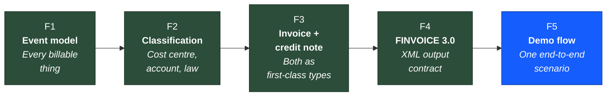
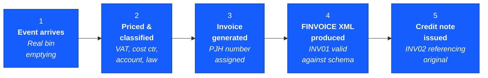

# PJH Invoicing — Release 1

**Goal:** Build the Finnish foundation that everything else lands on. Ship one narrow end-to-end scenario on top of it that PJH can click through and validate.

**Source:** All claims anchor to specific requirements in Jira release [11436](https://ioteelab.atlassian.net/projects/PD/versions/11436/tab/release-report-all-issues).

**Mockup:** Interactive Release 1 mockup → [Open mockup ↗](/docsite/invoicing/mockups/r1-mockup.html)

---

## Why this is R1

The original release plan put the visible features first (visibility, proof of delivery) and the architectural work last. After analysing the platform, that order has a problem: every visible feature built in the early weeks reads from the *old Danish data model*. When the model is rebuilt later, those features get rebuilt too.

R1 inverts the order. We change the data model first, then we put the smallest possible UI on top to demonstrate it works end to end. Everything PJH sees on the demo day is built on the *correct* Finnish bones — so what they see in R2 and R3 is final, not a draft that gets thrown away.

Put differently: **R1 isn't "less features." It's the same features, in the order that doesn't waste work.**

---

## The five things R1 builds



**How to read this:** Four foundation pieces (green) build the spine. The demo flow (blue) is the one narrow scenario that proves the spine works. None of these can be skipped, and they land in this order — F2 needs F1, F3 needs F2, F4 needs F3.

---

## F1 — Event model rebuild

**Anchored to:** [PD-299](https://ioteelab.atlassian.net/browse/PD-299), [PD-296](https://ioteelab.atlassian.net/browse/PD-296), [PD-278](https://ioteelab.atlassian.net/browse/PD-278)

### What it is

Redesign the event table so every billable thing in the system carries every field a Finnish invoice needs.

The current Danish model does not carry cost centre, accounting account, service responsibility, public/private law tag, eco-fee breakdown, or VAT at event time. The new model carries all of them from day one.

### What an event must carry

Each event row needs: customer, product, **event date** (used for time-of-pricing), quantity, unit price, **VAT rate at the time of the event** (25.5% / 14% / 0% reverse charge), **cost centre**, **accounting account**, **service responsibility** (public-law / municipal-secondary / market-based), waste type, and eco-fee breakdown.

### Why "event date" matters

A bin gets emptied on 28 December 2025 at the old VAT rate. The invoice for that bin is generated on 15 January 2026 — after a VAT rate change. The system applies *the December VAT rate*, not today's. That only works if the VAT rate is stored on the event itself at the moment it was created. This is what [PD-299](https://ioteelab.atlassian.net/browse/PD-299) means by "billing event details."

### Why validation is part of this

[PD-278](https://ioteelab.atlassian.net/browse/PD-278) says events with missing mandatory data **cannot** enter the invoicing pipeline. The system catches this before invoices get generated, not after. So if a sludge tank emptying gets created without a cost centre, it shows up flagged as "Missing mandatory data" and stays out of the next invoice run until an office worker fixes it.

### Example in plain language

> Korhonen Maija lives in Hyvinkää. Her mixed-waste bin gets emptied on 12 May. The system creates an event with:
> - Customer: Korhonen Maija
> - Product: Sekajäte 240L tyhjennys
> - Event date: 2026-05-12
> - VAT: 25.5%
> - Cost centre: 20/200/3 (Hyvinkää household collection)
> - Account: 30002 (Kotitalousjäte revenue)
> - Service responsibility: Municipal
> - Amount: €7.93
>
> All fields present → status "Ready to invoice."
> Same event without the cost centre → status "Missing mandatory data" → blocked from invoicing.

---

## F2 — Classification model

**Anchored to:** [PD-296](https://ioteelab.atlassian.net/browse/PD-296), [PD-295](https://ioteelab.atlassian.net/browse/PD-295), [PD-284](https://ioteelab.atlassian.net/browse/PD-284), [PD-285](https://ioteelab.atlassian.net/browse/PD-285)

### What it is

The structural classifications that get stamped on every event line: cost centre, accounting account, and public-law vs private-law tag.

These aren't free text — they're entities. Cost centres have codes (`20/200/3`, `25/250/2`). Accounts have G/L numbers (`30001`, `30002`, `2942`). Each event line carries a reference to one of each.

### The "same product, different account" rule

[PD-295](https://ioteelab.atlassian.net/browse/PD-295) calls out something subtle: *the same product routes to a different account depending on context.* For example:

- "Mixed waste 240L emptying" for a municipal customer in Hyvinkää → account `30002` (Kotitalousjätteen keräys, public-law)
- "Mixed waste 240L emptying" for a business customer under a commercial contract → account `30005` (Yritysjätteen vastaanotto, market-based, reverse-charge VAT)

Same product. Different account. Different VAT rule. The classification model supports this — the account is not hard-coded onto the product.

### Public-law vs private-law tag

The most important classification. Under Finnish law, the two follow completely different collection processes if unpaid:

- **Public-law invoice** (julkisoikeudellinen) → if unpaid, can be sent to ulosotto (direct enforcement) without a court judgment
- **Private-law invoice** (yksityisoikeudellinen) → if unpaid, follows normal commercial debt collection

The tag attaches at the **invoice line level** (not the invoice level), because a single invoice can contain both kinds — for example, a municipal customer who buys a composter from us alongside their normal waste collection.

### Example in plain language

> The system has 12 cost centres, organised by region and service type. Examples:
> - `20/200/3` — Hyvinkää household collection
> - `22/200/3` — Riihimäki household collection
> - `25/250/2` — Hyvinkää TSV (municipal secondary)
> - `30/300/1` — Hyvinkää reception (weighbridge intake)
>
> And 14 accounts. Examples:
> - `30001` Perusmaksutuotot — public-law base fee revenue
> - `30002` Kotitalousjäte — public-law household collection
> - `30005` Yritysjätteen vastaanotto — market-based commercial waste
> - `2942` ALV 0% — reverse-charge VAT account
>
> When an event lands, the pricing engine looks up: *what product? what region? what customer? what contract?* — and stamps the right cost centre + account + legal tag onto the line.

### Why we need [PD-285](https://ioteelab.atlassian.net/browse/PD-285) *and* [PD-284](https://ioteelab.atlassian.net/browse/PD-284)

These two PDs look similar but cover different angles:
- [PD-285](https://ioteelab.atlassian.net/browse/PD-285) is about **automatic classification** — the system figures out whether each transaction is public or private using rules
- [PD-284](https://ioteelab.atlassian.net/browse/PD-284) is about **how the invoice is structured** — combining mixed transactions on one invoice or splitting them onto separate invoices, with the right tag on each line

R1 covers both at the data layer. The UI to *configure* the splitting policy lands in R2 — for R1, PJH's existing convention applies.

---

## F3 — Invoice + credit note as first-class subtypes

**Anchored to:** [PD-269](https://ioteelab.atlassian.net/browse/PD-269), [PD-309](https://ioteelab.atlassian.net/browse/PD-309)

### What it is

Two distinct entities — **Invoice** and **CreditNote** — both subtypes of a shared base, **not** the same entity with a status flag.

### Why this matters more than it looks

A credit note in Finland is a legal document under Kirjanpitolaki (Finnish accounting law). It has to have its own sequential number and an explicit reference to the original invoice. The FINVOICE standard distinguishes them with separate message codes — INV01 for an invoice, INV02 for a credit note.

If credit notes were modelled as `Invoice.status = "credited"`, every correction-related feature in R2 and R3 would inherit that broken shape. Fixing the model later is painful — it means migrating historical data, re-tagging every credit, and reissuing any FINVOICE messages that went out wrong. So we model it correctly from day one.

### Invoice numbering ([PD-309](https://ioteelab.atlassian.net/browse/PD-309))

PJH uses a structured numbering scheme:

```
1 2 6 0 0 0 1 4 2
│ │ │_________│
│ │     │
│ │     └── Running sequence (7 digits)
│ │
│ └── Year (6 = 2026)
│
└── Legal class:
    1 = public law
    2 = private law
    3 = credit note
```

So:
- `126000142` → the 142nd public-law invoice of 2026
- `226000044` → the 44th private-law invoice of 2026
- `326000007` → the 7th credit note of 2026

Sequence numbers are never reused, even after cancellation. A mixed-law customer gets two parallel invoices, each with its own number from the right series.

### Example in plain language

> An invoice goes out to Rakennus Virtanen Oy for €98.40 — invoice `226000044`. A day later we notice the wrong tariff was applied.
>
> ❌ Wrong way: flip `invoice.status` to "credited" and reissue. This breaks Finnish accounting law and corrupts the FINVOICE output.
>
> ✅ Right way: issue credit note `326000007`, which is a separate document with its own number and a reference back to `226000044`. Both documents now exist permanently in the system. The customer sees two entries: the original invoice and the credit. Their net owed is €0.
>
> The wrong tariff is then corrected and a fresh invoice `226000045` is issued for the right amount.

---

## F4 — FINVOICE 3.0 schema mapping

**Anchored to:** [PD-310](https://ioteelab.atlassian.net/browse/PD-310)

### What it is

Generate valid FINVOICE 3.0 XML from the data model. The output passes XSD validation against the official Finanssiala schema and the EN16931 business rules. R1 stops at generation — we don't transmit to Ropo yet (transmission is [PD-107](https://ioteelab.atlassian.net/browse/PD-107), R3, because the commercial operator agreement work runs in parallel).

### Why this lands in R1, not later

FINVOICE is the **output contract**. Every field FINVOICE requires has to exist somewhere in our internal model. If we design the model without checking against FINVOICE, we'll find missing fields when we go to generate the XML and have to add them retroactively to every layer above.

Doing the mapping in R1 forces the model to be FINVOICE-complete from day one.

### What FINVOICE requires for every invoice

| Field | Where it comes from | R1 source |
|---|---|---|
| Sender (business ID, name, address) | Static config | Hard-coded |
| Recipient name + at least one address | CRM customer record | [PD-278](https://ioteelab.atlassian.net/browse/PD-278) mandatory data |
| Invoice number | PJH sequence | [PD-309](https://ioteelab.atlassian.net/browse/PD-309) |
| Invoice date, due date | Generated at invoice time | [PD-278](https://ioteelab.atlassian.net/browse/PD-278) |
| Payment reference (viitenumero) | Generated from invoice number | [PD-310](https://ioteelab.atlassian.net/browse/PD-310) |
| Per-row article, quantity, price, VAT rate, VAT code | Invoice lines | [PD-299](https://ioteelab.atlassian.net/browse/PD-299) / [PD-310](https://ioteelab.atlassian.net/browse/PD-310) |
| Per-row accounting dimensions (cost centre, account) | Classification model | [PD-296](https://ioteelab.atlassian.net/browse/PD-296) |
| Language code (fixed to FI in R1) | Hard-coded | [PD-310](https://ioteelab.atlassian.net/browse/PD-310) |
| Public/private law tag per line | Classification model | [PD-284](https://ioteelab.atlassian.net/browse/PD-284) / [PD-285](https://ioteelab.atlassian.net/browse/PD-285) |

### Example in plain language

> Invoice `126000142` for Korhonen Maija → the system produces an XML file like this (abbreviated):
>
> ```xml
> <Finvoice Version="3.0">
>   <MessageDetails>
>     <MessageIdentifier>126000142</MessageIdentifier>
>     <SpecificationIdentifier>EN16931</SpecificationIdentifier>
>   </MessageDetails>
>   <SellerPartyDetails>
>     <SellerOrganisationName>Päijät-Hämeen Jätehuolto Oy</SellerOrganisationName>
>     <SellerOrganisationTaxCode>1782934-5</SellerOrganisationTaxCode>
>   </SellerPartyDetails>
>   <BuyerPartyDetails>
>     <BuyerOrganisationName>Korhonen Maija</BuyerOrganisationName>
>     <BuyerStreetName>Mäntytie 14</BuyerStreetName>
>     <BuyerTownName>Hyvinkää</BuyerTownName>
>   </BuyerPartyDetails>
>   <InvoiceDetails>
>     <InvoiceTypeCode>INV01</InvoiceTypeCode>
>     <InvoiceNumber>126000142</InvoiceNumber>
>     <InvoiceTotalVatExcludedAmount Currency="EUR">46,33</InvoiceTotalVatExcludedAmount>
>     <InvoiceTotalVatAmount Currency="EUR">11,81</InvoiceTotalVatAmount>
>     <InvoiceTotalVatIncludedAmount Currency="EUR">58,14</InvoiceTotalVatIncludedAmount>
>   </InvoiceDetails>
>   <InvoiceRow>
>     <ArticleName>Sekajätteen tyhjennys 240L</ArticleName>
>     <RowVatRatePercent>25.50</RowVatRatePercent>
>     <AccountDimensionText>30002</AccountDimensionText>
>     <DimensionText>20/200/3</DimensionText>
>     <RowAmount Currency="EUR">7,93</RowAmount>
>   </InvoiceRow>
> </Finvoice>
> ```
>
> The XML is downloadable from the UI for inspection. It passes XSD validation against the Finanssiala FINVOICE 3.0 schema and the EN16931 business rules. It is not transmitted to Ropo in R1.

---

## F5 — The demo flow

The proof. One narrow path through the spine, end to end, demonstrated with real PJH data.



**How to read this:** Each step lives on a tab in the mockup. Click any step to jump to its screen. The whole chain runs against one real PJH customer with real events — no synthetic data, no shortcuts. If any link in the chain breaks, R1 isn't done.

### What PJH actually sees on demo day

1. They pick a customer they recognise from their own data (e.g. Korhonen Maija)
2. They see her events from the past month, with all the new classification fields populated correctly
3. They watch an invoice get generated with a valid PJH invoice number (`126000142`)
4. They see the FINVOICE 3.0 XML output for that invoice, syntax-highlighted, schema-validated
5. They issue a credit note against it, and see the credit note carry its own number (`326000007`) and reference back to the original

If they can verify each step with their own eyes against their own data, R1 is done.

---

## What R1 does *not* include

Saying no is part of the brief. These all matter — they're just in R2 or R3:

| Out of R1 | Lands in | Why later |
|---|---|---|
| Full UI for invoice editing, batch operations, error correction | R2 | Builds on the foundation; needs [PD-297](https://ioteelab.atlassian.net/browse/PD-297) lifecycle states |
| Billing cycles (monthly / quarterly / annual configurable per customer) | R2 | [PD-290](https://ioteelab.atlassian.net/browse/PD-290) / [PD-291](https://ioteelab.atlassian.net/browse/PD-291) is a major engine change — separate work |
| Surcharges, minimum fees, reverse VAT, gross/net rules | R2 | [PD-286](https://ioteelab.atlassian.net/browse/PD-286), [PD-294](https://ioteelab.atlassian.net/browse/PD-294), [PD-300](https://ioteelab.atlassian.net/browse/PD-300), [PD-301](https://ioteelab.atlassian.net/browse/PD-301) — pricing rules on top of the model |
| Multi-language invoices | R2 | [PD-308](https://ioteelab.atlassian.net/browse/PD-308) — needs CRM-side language field |
| FINVOICE transmission to Ropo | R3 | [PD-107](https://ioteelab.atlassian.net/browse/PD-107) — commercial operator agreement runs in parallel |
| E-invoice address management | R3 | [PD-282](https://ioteelab.atlassian.net/browse/PD-282) — needs CRM-side work |
| Reporting, AR ageing, PDF invoice preview | R3 | [PD-289](https://ioteelab.atlassian.net/browse/PD-289), [PD-177](https://ioteelab.atlassian.net/browse/PD-177) — separate concern |
| Shared service splits (one event split across multiple customers) | R3 | [PD-279](https://ioteelab.atlassian.net/browse/PD-279), [PD-280](https://ioteelab.atlassian.net/browse/PD-280) — complex pricing rule |
| Retroactive changes, simulation mode | R3 | [PD-364](https://ioteelab.atlassian.net/browse/PD-364), [PD-272](https://ioteelab.atlassian.net/browse/PD-272), [PD-274](https://ioteelab.atlassian.net/browse/PD-274) — depend on the engine being stable |

---

## R1 task inventory

The ten PD requirements that R1 delivers:

| PD | Title | What R1 ships |
|---|---|---|
| [PD-269](https://ioteelab.atlassian.net/browse/PD-269) | Credit invoices | Credit note as a first-class subtype; INV02 generation; custom text + internal comment |
| [PD-275](https://ioteelab.atlassian.net/browse/PD-275) | Transfer & copy of billed events | Data model only — UI lands in R3 |
| [PD-278](https://ioteelab.atlassian.net/browse/PD-278) | Error listing of events | Validation rules — UI for the error list lands in R2 |
| [PD-284](https://ioteelab.atlassian.net/browse/PD-284) | Public & private law sales — billing | Line-level legal tag; FINVOICE export of the classification |
| [PD-285](https://ioteelab.atlassian.net/browse/PD-285) | Private & public law invoices | Automatic classification rules at event time |
| [PD-295](https://ioteelab.atlassian.net/browse/PD-295) | Account and cost centre data | Account management (main users); routing rules |
| [PD-296](https://ioteelab.atlassian.net/browse/PD-296) | Cost centres and accounts on events | Cost centre + account stamped on every event line |
| [PD-299](https://ioteelab.atlassian.net/browse/PD-299) | Billing event details | New event schema with all PJH-required fields |
| [PD-309](https://ioteelab.atlassian.net/browse/PD-309) | Invoice numbering sequence | PJH sequence (1/2/3 prefix, year, running number) |
| [PD-310](https://ioteelab.atlassian.net/browse/PD-310) | FINVOICE data | XML generation (INV01 + INV02), XSD + EN16931 validation |

---

## The R1 mockup

The screens devs will build live in the interactive mockup → [r1-mockup.html](./r1-mockup.html)

Seven tabs walk through what R1 produces:

1. **Events** — the new event schema in action, with the validation status column showing [PD-278](https://ioteelab.atlassian.net/browse/PD-278) in effect
2. **Cost centres** — read-only view of what's configured (per [PD-296](https://ioteelab.atlassian.net/browse/PD-296))
3. **Accounting accounts** — main-user management (per [PD-295](https://ioteelab.atlassian.net/browse/PD-295))
4. **Invoices** — the invoices R1 produces with the [PD-309](https://ioteelab.atlassian.net/browse/PD-309) numbering on display
5. **Credit notes** — credit notes with original-invoice references and INV02 codes
6. **Invoice detail** — split view of an invoice's lines and the FINVOICE 3.0 XML output side by side
7. **Demo flow** — the five-step walkthrough, clickable

Every column header, every PD chip, every screen anchors to a specific R1 requirement. If something appears in the mockup that doesn't trace to one of the ten PDs above, it's a bug in the mockup.

---

*Document prepared: 2026-05-18 · Ledger squad · WasteHero invoicing module*
