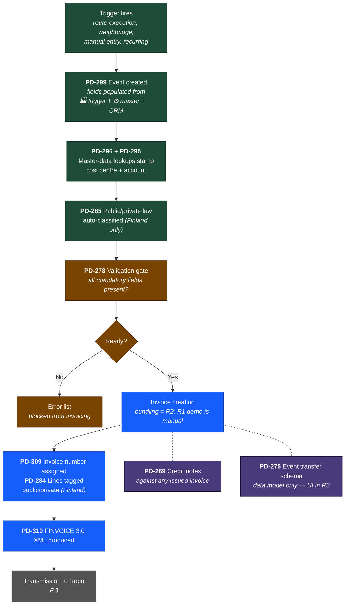

# R1 Invoicing — How the 10 PDs Work Together

## The starting point

> So what I get is that we have the events that come from triggers, these events need to pull data from the event that triggered it, master data set at the time of the trigger, and CRM data. What about the rest in R1?

That's exactly right. An event isn't a single source of truth — it's a small trigger record that immediately pulls in data from three places:

- **🏭 The trigger itself** — what happened (route execution, weighbridge reading, manual entry, recurring schedule)
- **⚙️ Master data / settings** — configuration tables looked up at event creation time (cost centres, accounts, price lists, VAT rates, routing rules)
- **🔗 CRM** — customer and property records (service responsibility, address, customer type, contract terms)

That accounts for **4 of the 10 R1 PDs**:

- [PD-299](https://ioteelab.atlassian.net/browse/PD-299) — the event schema itself (what fields exist, how data gets stamped in)
- [PD-296](https://ioteelab.atlassian.net/browse/PD-296) — the cost-centre and account fields that get looked up from master data
- [PD-295](https://ioteelab.atlassian.net/browse/PD-295) — the routing rules that decide *which* cost centre and *which* account to stamp on
- The CRM dependency — currently blocked because WH 1.0 doesn't yet have the migrated fields (service responsibility, cost centre mapping, zone, customer type) from WH 2.0

So the question is: what about the other 6 PDs?

---

## The remaining 6 PDs in R1

### Sitting just above the event layer

#### [PD-278](https://ioteelab.atlassian.net/browse/PD-278) — Validation gate

After an event is created (trigger + lookups + CRM data), PD-278 checks: *does this event have everything it needs to be invoiced?* If yes, the event is "Ready to invoice." If no, the event lands in the error list with the specific missing field flagged.

Think of it as a checkpoint between *event creation* and *anything else happening*. Nothing moves forward until PD-278 says it can.

### Sitting in the middle — legal classification

#### [PD-284](https://ioteelab.atlassian.net/browse/PD-284) and [PD-285](https://ioteelab.atlassian.net/browse/PD-285) — Public/private law tag

PD-285 looks at the event (customer type, product, region) and decides: *is this transaction public-law or private-law?* That decision gets stamped on the event as a tag. PD-284 governs what happens with that tag on the invoice — whether public and private events go on the same invoice with line-level tags, or get split onto separate invoices.

Two PDs, one feature. PD-285 is the brain, PD-284 is the policy.

These are the Finland-specific ones — they only run if the tenant has the feature enabled.

### Sitting on top — invoice production

#### [PD-309](https://ioteelab.atlassian.net/browse/PD-309) — Invoice numbering

When validated events get grouped into an invoice, the invoice needs a number. PD-309 assigns one from the configured sequence. For PJH that's the 1/2/3-prefix scheme (1=public, 2=private, 3=credit). For another tenant it'd be their own scheme.

Numbers are stamped at invoice creation, never reused.

#### [PD-269](https://ioteelab.atlassian.net/browse/PD-269) — Credit notes

When an invoice goes out wrong, PD-269 lets office staff issue a credit note against it. The credit note is its own document with its own number (from the credit-note series in PD-309), references the original invoice, carries custom text + internal comment, and stays in the customer's transaction history alongside the original.

### Sitting at the very end — output

#### [PD-310](https://ioteelab.atlassian.net/browse/PD-310) — FINVOICE 3.0 export

Takes the invoice (with all its events as lines, all the classifications stamped on, all the dimensions filled in) and produces the FINVOICE 3.0 XML output. Reads everything from the layers below — event data, cost centres, accounts, legal tag, invoice number, credit-note reference — and serialises it into the standard format.

For PJH that's FINVOICE. For another country it'd be a different format using the same internal data.

### The one intentionally skipped in R1

#### [PD-275](https://ioteelab.atlassian.net/browse/PD-275) — Transfer and copy of billed events

R1 builds this as **data model only** — the database supports the operation but there's no UI. The user-facing transfer feature lands in R3. This sits in the same logical layer as PD-269 (corrections to already-invoiced events) but R1 just makes sure the schema supports it.

---

## The full picture

Putting it all together, R1 layers like this:

**How to read this:**
- Green = event layer (trigger and lookups)
- Amber = validation gate
- Blue = invoice production
- Grey = deferred (out of R1)
- Purple = side concerns (credit notes, event transfer)

---

## In one sentence

Once an event is created with trigger + master + CRM data, [PD-278](https://ioteelab.atlassian.net/browse/PD-278) validates it, [PD-285](https://ioteelab.atlassian.net/browse/PD-285)/[PD-284](https://ioteelab.atlassian.net/browse/PD-284) tags it for legal classification, [PD-309](https://ioteelab.atlassian.net/browse/PD-309) numbers the invoice it lands on, [PD-310](https://ioteelab.atlassian.net/browse/PD-310) exports the result, and [PD-269](https://ioteelab.atlassian.net/browse/PD-269)/[PD-275](https://ioteelab.atlassian.net/browse/PD-275) handle corrections.

---

## Summary table

| PD | Sits at | What it does |
|---|---|---|
| [PD-299](https://ioteelab.atlassian.net/browse/PD-299) | Event layer | Defines event schema, populated from trigger + master + CRM |
| [PD-296](https://ioteelab.atlassian.net/browse/PD-296) | Event layer | Stamps cost centre + account on every event |
| [PD-295](https://ioteelab.atlassian.net/browse/PD-295) | Event layer | Routing rules that decide which cost centre/account |
| [PD-278](https://ioteelab.atlassian.net/browse/PD-278) | Validation gate | Blocks invalid events from invoicing |
| [PD-285](https://ioteelab.atlassian.net/browse/PD-285) | Classification | Auto-classifies events as public-law or private-law (Finland) |
| [PD-284](https://ioteelab.atlassian.net/browse/PD-284) | Classification | Policy for combining/splitting public + private on invoices (Finland) |
| [PD-309](https://ioteelab.atlassian.net/browse/PD-309) | Invoice production | Assigns invoice numbers from configured sequence |
| [PD-269](https://ioteelab.atlassian.net/browse/PD-269) | Corrections | Issue credit notes against invoices |
| [PD-275](https://ioteelab.atlassian.net/browse/PD-275) | Corrections | Schema for transferring events (UI in R3) |
| [PD-310](https://ioteelab.atlassian.net/browse/PD-310) | Output | Produces FINVOICE 3.0 XML (Finland) |

---

*Document prepared: 2026-05-19 · Ledger squad · WasteHero invoicing module*
